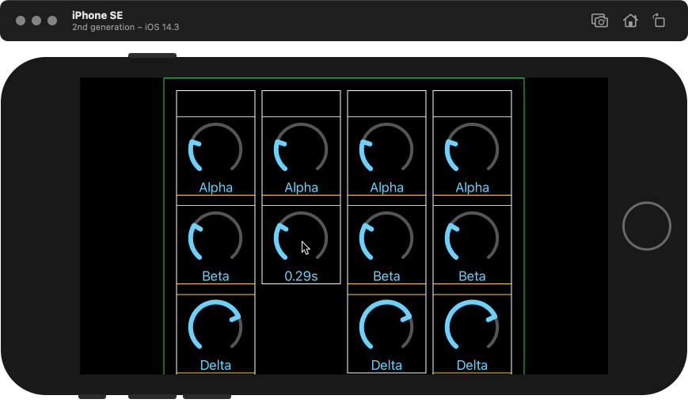

#  Drag Gesture Demo

This is a simple SwiftUI app that illustrates some issues involving using a drag gesture for a view that is embedded in a `ScrollView` view.



The `ContentView` consists of the following nested views:

```
ScrollView
  HStack
    VStack
      KnobView
        ZStack
        Label
      ...
```

with 4 `VStack` entries with varying number of `KnobView` entries.

The green border is from the `HStack` view, the white borders are from the 4 `VStack` views, and the yellow borders come from the individual `KnobView` views.

The knobs respond to a touch gesture to show the current value and up/down drag gestures to change their values. Ideally, the touch would be restricted to the yellow box, but this is not 
the case. One would expect a touch in  between two white boxes to scroll the `ScrollView` but this is not the case because for some reason it is captured by the drag gesture of one of 
the knobs.

The `KnobView` body contains a `.contentShape(Rectangle())` modifier which is necessary to capture touch events near the center of the `KnobView`.

The complex combination of long-press gesture + drag gesture seems to be necessary to obtain any hit at all in the `KnobView`. I was not successful getting a `KnobView` to respond to 
just a `dragGesture` by itself. Every drag would just move the `ScrollView`.

Finally, even with this complex setup, events sometimes go to the wrong view. This could be due to the transition from the long-press gesture to the drag gesture.
